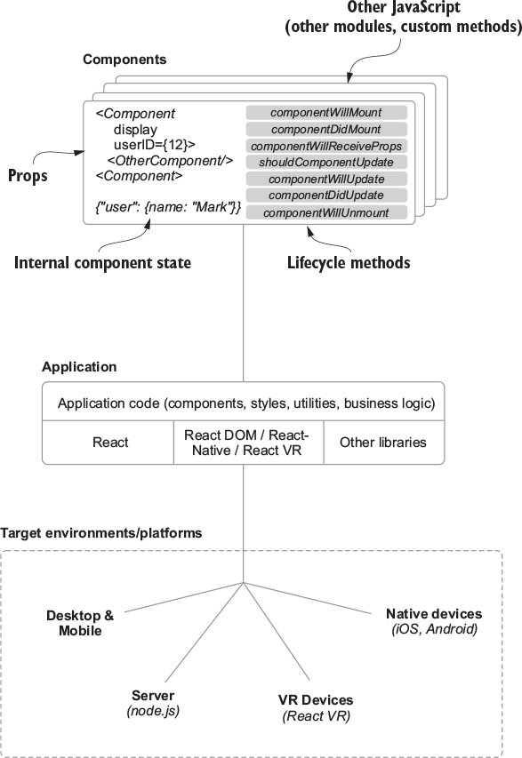
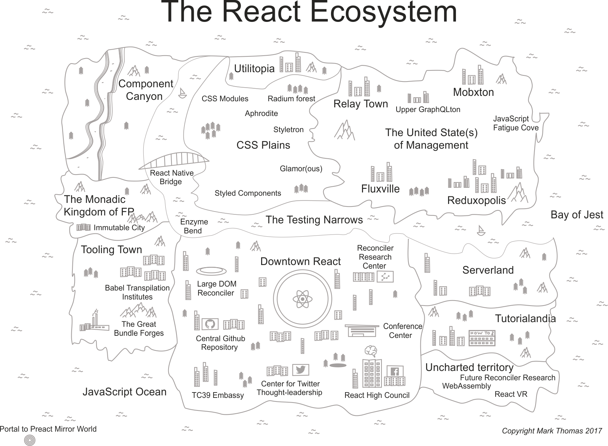
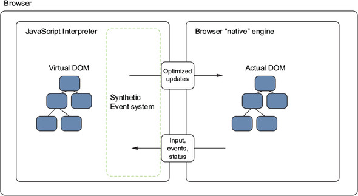
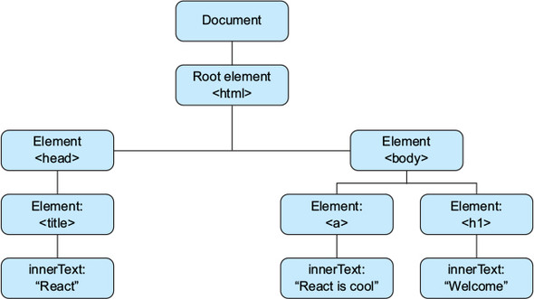
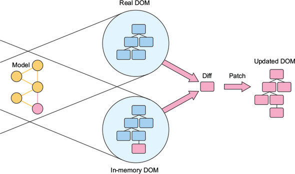
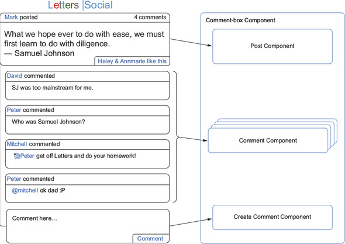

**Chapter 1. Meet React**

> maanfjlh【】sharklasers.com

This chapter covers
- Introducing React
- Some of React’s high-level concepts and paradigms
- The virtual DOM
- Components in React
- React for teams
- Tradeoffs of using React

<!-- vim-markdown-toc GFM -->

* [1.1. Meet React](#11-meet-react)
    * [1.1.1. Who this book is for](#111-who-this-book-is-for)
    * [1.1.2. A note on tooling](#112-a-note-on-tooling)
    * [1.1.3. Who uses React?](#113-who-uses-react)
* [1.2. What does React not do?](#12-what-does-react-not-do)
* [1.3. The virtual DOM](#13-the-virtual-dom)
    * [1.3.1. The DOM](#131-the-dom)
    * [1.3.2. The virtual DOM](#132-the-virtual-dom)
    * [1.3.3. Updates and diffing](#133-updates-and-diffing)
    * [1.3.4. Virtual DOM: Need for speed?](#134-virtual-dom-need-for-speed)
* [1.4. Components: The fundamental unit of React](#14-components-the-fundamental-unit-of-react)
    * [1.4.1. Components in general](#141-components-in-general)
    * [1.4.2. Components in React: Encapsulated and reusable](#142-components-in-react-encapsulated-and-reusable)
* [1.5. React for teams](#15-react-for-teams)
* [1.6. Summary](#16-summary)

<!-- vim-markdown-toc -->

# 1.1. Meet React
React is a JavaScript library for building user interfaces across a variety of platforms. React gives you a powerful mental model to work with and helps you build user interfaces in a declarative and component-driven way.

Where does React fit into the broader world of web engineering? You’ll often hear **_React_** talked about in the same space as projects like **_Vue, Preact, Angular, Ember, Webpack, Redux_** and other well-known JavaScript libraries and frameworks. React is often a major part of front-end applications and shares similar features with the other libraries and frameworks just mentioned. In fact, many popular front-end technologies are more like React in subtle ways now than in the past.

Components in React should be easy to think about and integrate with other React components; they follow a predictable lifecycle, can maintain their own internal state, and work with “regular old JavaScript”.
- Components
- React libraries
- Third-party libraries
- Running a React application

    

## 1.1.1. Who this book is for
You'll learn the fundamental concepts of React and you’ll have access to a sample application written in React—check out the running app at https://social.react.sh. You’ll be able to see the basics of building a React application in practice and how it might be suited to your team or next project.

## 1.1.2. A note on tooling
You don’t need to be a master of Webpack, Babel, or other tools to enjoy and read this book.

You can learn about npm at https://docs.npmjs.com/getting-started/what-is-npm .

## 1.1.3. Who uses React?
I mention various libraries and projects throughout the course of the book, but if you’re curious to learn more about the React ecosystem, I’ve put together a guide at https://ifelse.io/react-ecosystem.

    

# 1.2. What does React not do?
# 1.3. The virtual DOM

    

## 1.3.1. The DOM
The DOM provides a structured way of accessing, storing, and manipulating different parts of a document.

    

Common methods or properties you may have used to update or query a web page might include `getElementById`, `parent.appendChild`, `querySelectorAll`, `innerHTML`, and others.

## 1.3.2. The virtual DOM
The web APIs in browsers let us interact with web documents with JavaScript via the DOM. But if we can already do this, why do we need something else in between? I want to first state that React’s implementation of a virtual DOM doesn’t mean that the regular web APIs are bad or inferior to React. Without them, React can’t work. There are, however, certain pain points of working directly with the DOM in larger web applications. Generally, these pain points arise in the area of change detection. When data changes, we want to update the UI to reflect that. Doing that in a way that’s efficient and easy to think about can be difficult, so React aims to solve that problem.

## 1.3.3. Updates and diffing

    

## 1.3.4. Virtual DOM: Need for speed?
Together, speed and simplicity mean happier users and happier developers—a win-win!

I’ve spent some time talking about the virtual DOM, but I don’t want to give you the idea that it will be an important part of working with React. In practice, you won’t need to be thinking extensively about how the virtual DOM is accomplishing your data updates or making your changes to your application. That’s part of the simplicity of React: you’re freed up to focus on the parts of your application that need the most focus.

# 1.4. Components: The fundamental unit of React
React doesn’t just use a novel approach to dealing with changing data over time; it also focuses on components as a paradigm for organizing your application. Components are the most fundamental unit of React. There are several different ways you can create components with React, which future chapters will cover.

## 1.4.1. Components in general
An example of an interface broken into components. Each distinct section can be thought of as a component. Items that repeat in a uniform nature can be thought of as one component that gets reused over different data.

    

## 1.4.2. Components in React: Encapsulated and reusable

# 1.5. React for teams
The simplicity, un-opinionated nature, and performance of React make it a great fit for projects small and large alike. As you keep exploring React, you’ll see how it can be a good fit for your team and projects.

# 1.6. Summary
- React is a library for building user interfaces, originally created by engineers at Facebook.
- React provides a simple, flexible API that’s based around components.
- Components are the fundamental unit of React, and they’re used extensively in React applications.
- React implements a virtual DOM that sits between your program and the browser DOM.
- The virtual DOM allows for efficient updates to the DOM using a fast diffing algorithm.
- The virtual DOM allows for excellent performance, but the biggest win is the mental model that it affords.
