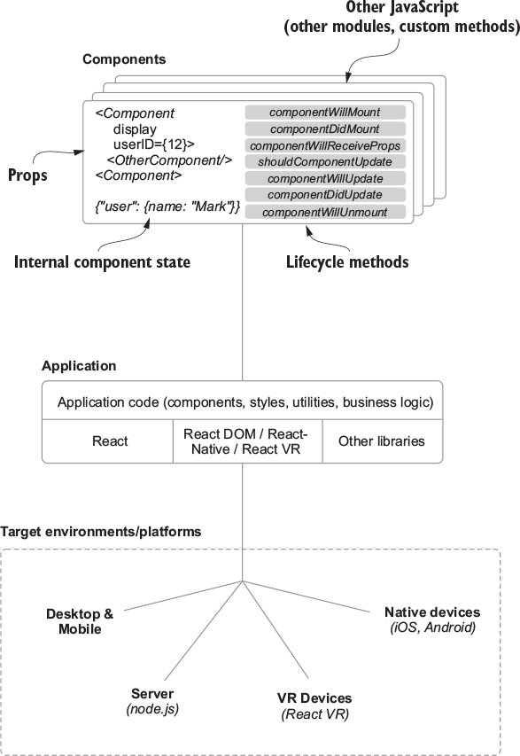
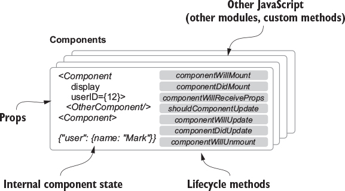
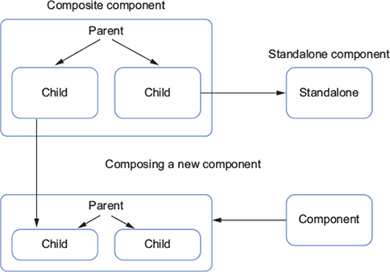
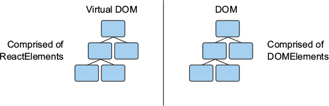
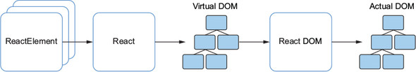
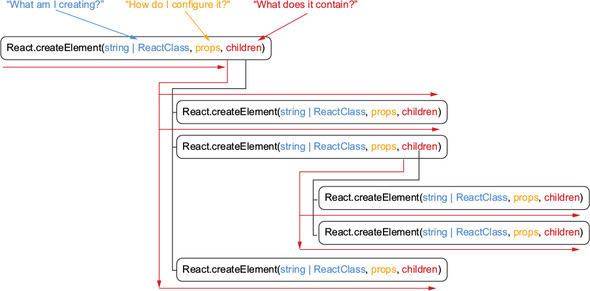
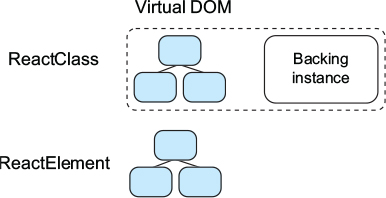
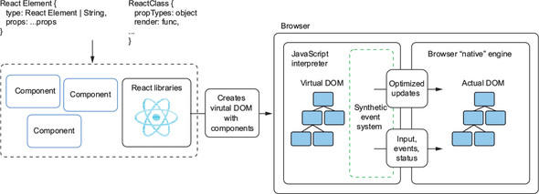

**Chapter 2. Hello World: our first component**

> feewhmrx【】sharklasers.com

This chapter covers
- Thinking about user interfaces with components
- Components in React
- How React renders components
- Different ways of creating components in React
- Using JSX in React


<div align="center">
    
</div>

# 2.1. Introducing React components
Components are the fundamental unit of a client-side application written in React. You’ll definitely be creating lots of components!

<div align="center">
    
</div>

## 2.1.1. Understanding the application data

Sample JSON API:
```json
{
  "id": 123,
  "content": "What we hope ever to do with ease, we must first learn to do
     with diligence. — Samuel Johnson",
  "user": {
     "name": "Mark Thomas",
     "id": 1
  },
  "comments": [{
    "id": 0,
    "user": "David",
    "content": "too. mainstream."
  }, {
    "id": 1,
    "user": "Peter",
    "content": "Who was Samuel Johnson?"
  }, {
    "id": 2,
    "user": "Mitchell",
    "content": "@Peter get off Letters and do your homework!"
  }, {
    "id": 3,
    "user": "Peter",
    "content": "@mitchell ok dad :P"
  }]
}
```

## 2.1.2. Multiple components: Composition and parent-child relationships
 Components can have different types of relationships (parent and child), can be used to create other components, or can even stand alone. They can often be easily moved around because they’re self-contained and don’t carry any baggage when moved. As such, they’re said to be composable.

<div align="center">
    
</div>

## 2.1.3. Establishing component relationships

# 2.2. Creating components in React

You’ll run code in the browser via [CodeSandbox](https://codesandbox.io).

You’ll use three libraries for your first components: `React`, `React DOM`, and `prop-types`.


Starting out follow as:
```js
//... index.js
const node = document.getElementById("root");

//... index.html
<div id="root"></div>
```

Code is available online at https://codesandbox.io/s/vj9xkqzkvy.

## 2.2.1. Creating React elements
```js
ReactDOM.render(
  ReactElement element,
  DOMElement container,
  [function callback]
) -> ReactComponent
```
React DOM needs an element of type `ReactElement` and a DOM element.

The virtual and “real” DOM share a similar tree-like structure, which makes it easy for you to think about the structure of your components and overall application in React in similar ways. The DOM is comprised of `DOMElements` (`HTMLElements` and `SVGElements`), whereas React’s virtual DOM is comprised of React elements.

<div align="center">
    
</div>

React elements are what React uses to create a virtual DOM that `React DOM` will manage and use to reconcile and update the actual DOM. They are simple blueprints for React to use in creating and managing elements.

<div align="center">
    
</div>


You now know a little more about React elements in general, but how do they get created and what goes into creating them? You create React elements with `React.createElement`—go figure! Let’s look at its function signature to find out how you should use it:

```js
React.createElement(
  String/ReactClass type,
  [object props],
  [children...]
) -> React Element
```

`React.createElement` takes a string or component (either a class extending React.Component or a function), a props object, and children and returns a React element. Remember, a React element is a lightweight representation of something you want React to render. It can indicate either a DOM element or another React component.


Let’s look more closely at each of these basic instructions:
- *type*
- *props*
- *children...*

`React.createElement` asks, “What am I creating?”, “How should I configure it?”, and “What does it contain?” The following listing shows how you might use `React.createElement`.
```js
import React from "react";
import { render } from "react-dom";
const node = document.getElementById("root");

const root = React.createElement(
  "div",
  {},
  React.createElement(
    "h1",
    {},
    "Hello, world!",
    React.createElement(
      "a",
      { href: "mailto:mark@ifelse.io" },
      React.createElement("h1", {}, "React In Action"),
      React.createElement("em", {}, "...and now it really is!")
    )
  )
);
render(root, node);
```

Code is available online at https://codesandbox.io/s/qxx7z86q4w.


## 2.2.2. Rendering your first component
Your first component. It’s not much, but you’ve successfully created a component using React.

<div align="center">
    
</div>


React will recursively evaluate a series of React elements to determine how it should form a virtual DOM tree structure for your components. It will also check for more React elements in `children...` to evaluate. React will go through every possible path, like a child asking, “What is X?” until they know everything. You can follow the arrows down and across to the right to get a sense of how React might evaluate nested React elements as well as what each parameter is asking.

<div align="center">
    
</div>


We’ll explore better ways to write components —— JSX.

## 2.2.3. Creating React components
Components serve to bundle up and group functionality, markup, styles, and other related bits of your UI together. They act as a sort of boundary around parts of your UI that can also contain other components. Components can then be independent, reusable pieces that allow you think about each piece in isolation.

## 2.2.4. Creating React classes
To start really building something, you need more than just React elements; you need components. Components in React are classes that help group together React elements and functionality. They can be created as classes that extend the `React.Component` base class or functions. This section explores React classes and how to use this type of component in React. Let’s look at how you create a React class:
```js
class MyReactClassComponent extends Component {
     render() {}
}
```
For more on using React without ES2015+ JavaScript, check out https://reactjs.org/docs/react-without-es6.html.

## 2.2.5. The render method
React will create a backing instance in memory for components created as React component classes. As you can see, React component classes get one, and React elements and non-React class components don’t. Remember that React elements are mirrors of the DOM and components are ways to group them together. The backing instance is a way of providing data storage and access for a specific component. The data stored in the instance will be made available to the component’s render method through specific API methods. This means that you get access to data that you can change and that will persist over time.

<div align="center">
    
</div>

## 2.2.6. Property validation via PropTypes
You know that React class components are free to use custom properties, and this sounds great; it’s as if you can create your own custom HTML elements but with even more functionality. Remember that with great power comes great responsibility. You need to provide some sort of way to validate which properties you’ll be using so you can prevent bugs and plan the sorts of data your components will use. To do that, you can use validators available from a namespace within React: `PropTypes`.

The `prop-types` library provides a set of validators that will let you specify what props your component needs or expects. For example, if you were going to build a ProfilePicture component, it wouldn’t be of much use without a picture (or the logic to handle not having one available). You could use `PropTypes` to specify which props your ProfilePicture component would need to work and what those props would look like.

```js
import React, { Component } from "react";
import { render } from "react-dom";
import PropTypes from "prop-types";

const node = document.getElementById("root");

class Post extends Component {
  render() {
    return React.createElement(
      "div",
      {
        className: "post" //#C
      },
      React.createElement(
        "h2",
        {
          className: "postAuthor",
          id: this.props.id
        },
        this.props.user, //#D
        React.createElement(
          "span",
          {
            className: "postBody" //#E
          },
          this.props.content //#F
        )
      )
    );
  }
}

Post.propTypes = {
  user: PropTypes.string.isRequired, //#G
  content: PropTypes.string.isRequired, //#G
  id: PropTypes.number.isRequired //#G
};

const App = React.createElement(Post, {
  id: 1, //#H
  content: " said: This is a post!", //#H
  user: "mark" //#H
});

render(App, node);
```

Code is available online at https://codesandbox.io/s/3yj462omrq.

Now that you’re creating a component and passing in some data, you can try nesting components. You can create components from other components with `children` property. I’ll cover this more in future chapters when you work with routing and higher-order components. When you use the `this.props.children` prop, it’s like an outlet for nested data to come through. In this case, you’ll create a `Comment` component, pass it as the argument, and achieve nesting it.

```js
import React, { Component } from "react";
import { render } from "react-dom";
import PropTypes from "prop-types";

const node = document.getElementById("root");

class Post extends Component {
  render() {
    return React.createElement(
      "div",
      {
        className: "post"
      },
      React.createElement(
        "h2",
        {
          className: "postAuthor",
          id: this.props.id
        },
        this.props.user,
        React.createElement(
          "span",
          {
            className: "postBody"
          },
          this.props.content
        ),
        this.props.children
      )
    );
  }
}

Post.propTypes = {
  user: PropTypes.string.isRequired,
  content: PropTypes.string.isRequired,
  id: PropTypes.number.isRequired
};

class Comment extends Component {
  render() {
    console.log("yo");
    return React.createElement(
      "div",
      {
        className: "comment"
      },
      React.createElement(
        "h2",
        {
          className: "commentAuthor"
        },
        this.props.user,
        React.createElement(
          "span",
          {
            className: "commentContent"
          },
          this.props.content
        )
      )
    );
  }
}

Comment.propTypes = {
  id: PropTypes.number.isRequired,
  content: PropTypes.string.isRequired,
  user: PropTypes.string.isRequired
};

const App = React.createElement(
  Post,
  {
    id: 1,
    content: " said: This is a post!",
    user: "mark"
  },
  React.createElement(Comment, {
    id: 2,
    user: "bob",
    content: " commented: wow! how cool!"
  })
);

render(App, node);
```

Code is available online at https://codesandbox.io/s/k2vn448pn3.

# 2.3. The life and times of a component
Zooming in on rendering in React. React classes and React elements are used by React to create an in-memory virtual DOM that manages the real DOM. It also creates a “synthetic” event system so that you can still react to events from the browser (such as clicks, scrolls, and other user-caused events).

<div align="center">
    
</div>

In addition to the reserved lifecycle methods, you can add your own methods. React gives you the freedom and flexibility to add whatever functionality you need to your components. Pretty much anything that’s valid JavaScript is useable in React. 

## 2.3.1. A React state of mind
What’s state? Another way to think about it is as information about something at a given time. You could, for example, get the “state” of your friend by asking “How are you today?”

There are two general types of state: **_mutable_** and **_immutable_**. A simple way to think about the difference between them is to think in terms of time. Can something change after being created? If so, it can be called mutable. If not, it can be called immutable. 

In React, components created as JavaScript classes (https://developer.mozilla.org/en-US/docs/Web/JavaScript/Reference/Classes) that extend `React.Component` may have both mutable and immutable state, whereas components created from functions (stateless functional components) only have access to immutable state (props).

I’ll cover these in future chapters; for now I’ll stick to components that inherit from `React.Component` and get state and additional methods. In these sorts of components, state is accessible from the `this.state` property of the instance of the class. The immutable state made available to you is accessed with `this.props`, which you’ve been using already to create static components.

`this.props` shouldn’t be modified from within the component. You’ll see ways to provide data that changes over time to components in future chapters. For now, all you need to know is that you can’t directly mutate `this.props`.

State and props are vehicles for the data that make up your app and make it useful.
