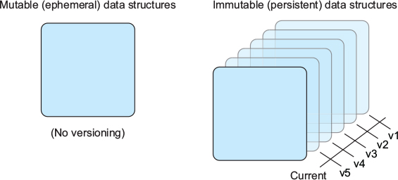
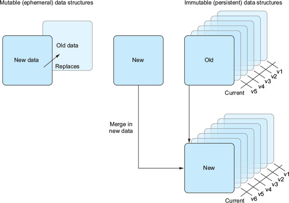
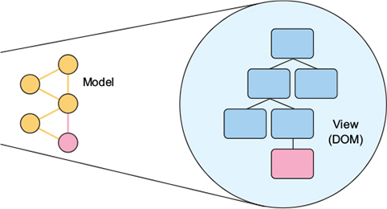
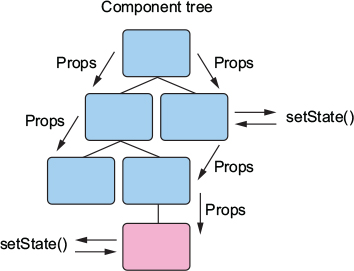

**Chapter 3. Data and data flow in React**

> wmahmork【】sharklasers.com

This chapter covers
- Mutable and immutable state
- Stateful and stateless components
- Component communication
- One-way data flow


<!-- vim-markdown-toc GFM -->

* [3.1. Introducing state](#31-introducing-state)
    * [3.1.1. What is state?](#311-what-is-state)
    * [3.1.2. Mutable and immutable state](#312-mutable-and-immutable-state)
* [3.2. State in React](#32-state-in-react)
    * [3.2.2. Immutable state in React: Props](#322-immutable-state-in-react-props)
    * [3.2.3. Working with props: PropTypes and default props](#323-working-with-props-proptypes-and-default-props)
    * [3.2.4. Stateless functional components](#324-stateless-functional-components)
* [3.3. Component communication](#33-component-communication)
* [3.4. One-way data flow](#34-one-way-data-flow)

<!-- vim-markdown-toc -->

# 3.1. Introducing state

In this section, you’ll learn about the following:
- State
- How React handles state
- How data flows through components

## 3.1.1. What is state?

**State** -- All the information a program has access to at a given instant in time.

Simple program state:
```js
const letters = 'Letters';
const splitLetters = letters.split('');
console.log("Let's spell a word!");
splitLetters.forEach(letter => console.log(letter));
```

If you want to use the browser debugger to do this, head to https://codesandbox.io/s/n9mvol5x9p.

## 3.1.2. Mutable and immutable state
In React, these are known as **state** (data you can change within a component) and **props** (data a component receives that shouldn’t be changed by the component). When you work with **Redux** in chapters 10 and 11, you’ll emulate immutable data structures.


We can slightly expand our notions of mutable and immutable to include their corresponding data structure types:
- **Immutable** — An immutable, persistent data structure supports multiple versions over time but can’t be directly overwritten; immutable data structures are generally persistent.
- **Mutable** — A mutable, ephemeral data structure supports only a single version over time; mutable data structures are overwritten when they change and don’t support additional versions.

Persistence and ephemerality in immutable and mutable data structures. Immutable or persistent data structures usually record a history and don’t change but rather make versions of what changed over time. Ephemeral data structures, on the other hand, usually don’t record history and get wiped out with each update.

<div align="center">
    
</div>

Handling changes with mutable and immutable data. Ephemeral data structures don’t have versions, so when you make changes to them, all previous state is gone. You could say that they live in the moment, whereas immutable data structures are able to persist over time.

<div align="center">
    
</div>

Even though JavaScript doesn’t support truly immutable data structures natively, React exposes component state in a mutable way (changeable via `setState`) and props as read-only. There’s a lot more to immutability and immutable data structures in general, but we don’t need to concern ourselves with them much more than we already have. If you’re still curious to learn more, an entire body of academic research is focused on this sort of question. There are also ways you can use immutable data structures extensively throughout your JavaScript apps (React or not) with libraries like Immutable JS (see https://facebook.github.io/immutable-js/ for more information), but in React we’ll only deal with the props and state APIs.


# 3.2. State in React
Components that inherit from the `React.Component` class will get access to this API. React will create and keep track of a backing instance for components created in this way. These components will also get access to a series of lifecycle methods discussed in the next chapter.

You can access state in your components that inherit from `React.Component` via `this.state`. In this case, `this` refers to the instance of the class, and `state` is the special property that React will keep track of for you.
```js
import React from "react";
import { render } from "react-dom";

class Secret extends React.Component {
  constructor(props) {
    super(props);
    this.state = {
      name: "top secret!"
    };
    this.onButtonClick = this.onButtonClick.bind(this);
  }
  onButtonClick() {
    this.setState(() => ({
      name: "Mark"
    }));
  }
  render() {
    return (
      <div>
        <h1>My name is {this.state.name}</h1>
        <button onClick={this.onButtonClick}>reveal the secret!</button>
      </div>
    );
  }
}

render(<Secret />, document.getElementById("root"));
```
You can see the code ad  https://codesandbox.io/s/ovxpmn340y.

There are patterns that enjoy significant popularity in the React community that allow you to rarely use component state at all (including **Redux, Mobx, Flux,** and others), and these are great to explore as options for your application—in fact, we’ll look at **Redux** in chapters 10 and 11.

Let’s look at the setState API a little more closely. It’s the primary way for changing dynamic state in React components, and you’ll use it often in your application. Let’s look at the method signature to see what you need to pass to it:
```js
setState(
  updater,
  [callback]
) -> void
```
`setState` takes a function to use to set the new state for the component and an optional callback function. The `updater` function has this signature:
```js
(prevState, props) => stateChange
```
Shallow merging with `setState`:
```js
import React from "react";
import { render } from "react-dom";
class ShallowMerge extends React.Component {
  constructor(props) {
    super(props);
    this.state = {
      user: {
        name: "Mark", //#A
        colors: {
          favorite: ""
        }
      }
    };
    this.onButtonClick = this.onButtonClick.bind(this);
  }
  onButtonClick() {
    this.setState({
      user: {
        //#B
        colors: {
          favorite: "blue"
        }
      }
    });
  }
  render() {
    return (
      <div>
        <h1>
          My favorite color is {this.state.user.colors.favorite} and my name is{" "}
          {this.state.user.name}
        </h1>
        <button onClick={this.onButtonClick}>show the color!</button>
      </div>
    );
  }
}

render(<ShallowMerge />, document.getElementById("root"));
```
You can easily create and run your React component on CodeSandbox at https://codesandbox.io/s/0myo6ny4ww.


## 3.2.2. Immutable state in React: Props

We’ve talked about how React lets you work with data in a mutable way via state and `setState`, but what about immutable data in React? In React, props are the primary way to pass immutable data. Any component can receive props (not just those that inherit from `React.Component`) and use them in their `constructor`, `render`, and `lifecycle` methods.

Props are data that gets passed to React components, either from a parent or from the `defaultProps` static method on the component itself. Whereas component state is localized to a single component, props are usually passed from a parent component.


## 3.2.3. Working with props: PropTypes and default props
Immutable props in React components:
```js
import React from "react";
import { render } from "react-dom";
import PropTypes from "prop-types";

class Counter extends React.Component {
  static propTypes = {
    //#A
    incrementBy: PropTypes.number,
    onIncrement: PropTypes.func.isRequired //#B
  };
  static defaultProps = {
    incrementBy: 1
  };

  constructor(props) {
    super(props);
    this.state = {
      count: 0
    };
    this.onButtonClick = this.onButtonClick.bind(this);
  }
  onButtonClick() {
    this.setState(function(prevState, props) {
      return { count: prevState.count + props.incrementBy };
    });
  }
  render() {
    return (
      <div>
        <h1>{this.state.count}</h1>
        <button onClick={this.onButtonClick}>++</button>
      </div>
    );
  }
}

render(<Counter incrementBy={1} />, document.getElementById("root"));
```

Run the code at https://codesandbox.io/s/31ml5pmk4m.

## 3.2.4. Stateless functional components
There is a type of component you can create that only uses props: a stateless functional component. These components are sometimes called stateless components, functional components, and other similar names by developers, which can make it hard to keep track of what’s being talked about. They usually mean the same thing: a React component that doesn’t inherit from `React.Component` and therefore doesn’t get access to component state or other lifecycle methods.

Stateless functional components:
```js
import React from "react";
import { render } from "react-dom";
import PropTypes from "prop-types";

function Greeting(props) {
  return <div>Hello {props.for}!</div>;
}

Greeting.propTypes = {
  for: PropTypes.string.isRequired
};

Greeting.defaultProps = {
  for: "friend"
};

render(<Greeting name="Mark" />, document.getElementById("root"));
```

Run the code at https://codesandbox.io/s/l756002969.


Stateless functional components can be powerful, especially when used in combination with a parent component that has a backing instance. Rather than having to set state across multiple components, you can create a single stateful parent component and use lightweight child components for the rest.

# 3.3. Component communication
When you built your simple comment box component, you saw that you can create components from other components. That’s one reason why React is great.

You can easily build other components from subcomponents while keeping things nicely bundled up. You’re also easily able to express **_is-a_** and **_has-a_** relationships between components. That means you can think about components as **_having a_** part to them as well as **_being a_** certain thing.

In React, if you want components to communicate with each other, you pass props, and when you pass props, you’re doing two simple things:
- Accessing data in the parent (either state or props)
- Passing that data to a child component

Passing props from parent to child:
```js
import React from "react";
import { render } from "react-dom";
import PropTypes from "prop-types";

const UserProfile = props => {
  return ;
};
UserProfile.propTypes = {
  pagename: PropTypes.string
};

UserProfile.defaultProps = {
  pagename: "erondu"
};

const UserProfileLink = props => {
  return <a href={`https://ifelse.io/${props.username}`}>{props.username}</a>;
};

const UserCard = props => {
  return (
    <div>
      <UserProfileLink username={props.username} />
      <UserProfile username={props.username} />
    </div>
  );
};

render(<UserCard username="erondu" />, document.getElementById("root"));
```

Run it at https://codesandbox.io/s/pm18mlz8jm.

# 3.4. One-way data flow
**Data binding** is the process that establishes a connection between the application UI and other data.

Data binding usually refers to the process of setting up a connection between data in your app and the view (the display of that data). Another way to think of this is as a projection of the data into something the user can see (for example, a view).

<div align="center">
    
</div>

Another way to think about data binding is as data **flow**.


Data flows one way in React. Props are passed from parent to child (from owner to ownee), and children can’t edit the state or props of a parent component. Each component that has a backing instance can modify its own state but can’t modify anything outside itself apart from setting the props of one of its children.


<div align="center">
    
</div>

Unidirectional flow is especially helpful in building UIs because it tends to make it easier to think about the way data moves through an application. Thanks to the hierarchy of components and the way props and state are localized to components, it’s generally easier to predict how data moves through an application.

It might sound nice in some ways to eschew this hierarchy and have the freedom to modify whatever you want from any part of your application, but in practice that tends to lead to applications that are hard to think about and can result in difficult debugging situations. Later chapters will explore architectural patterns like Flux and Redux that allow you to maintain a unidirectional data flow paradigm while coordinating actions that can occur across components or across your application.
