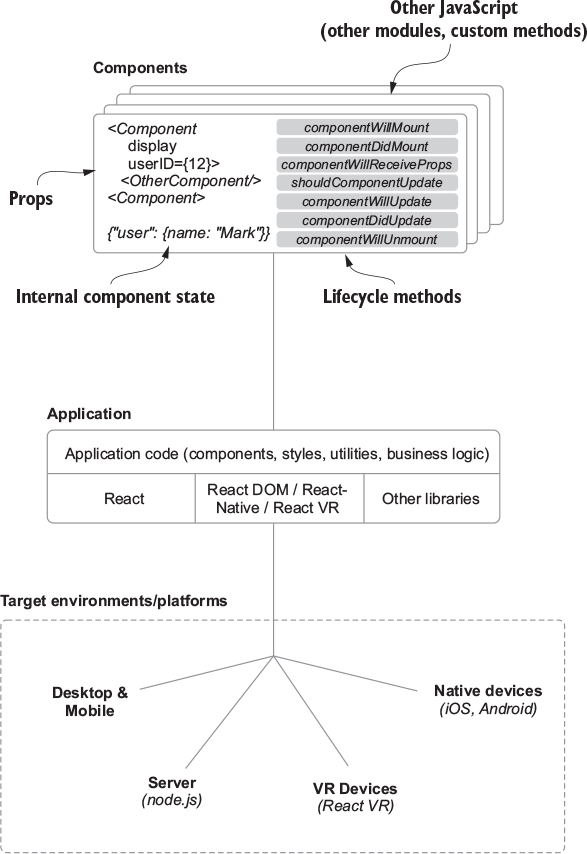
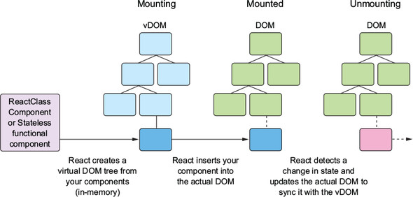
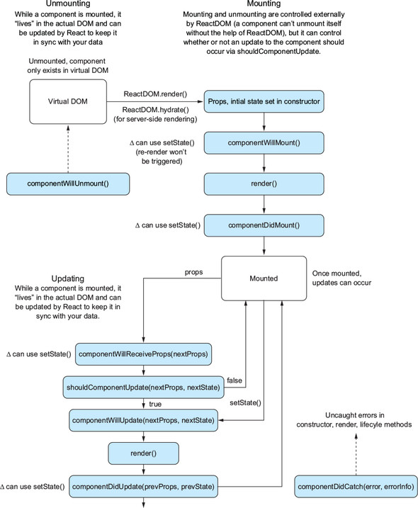
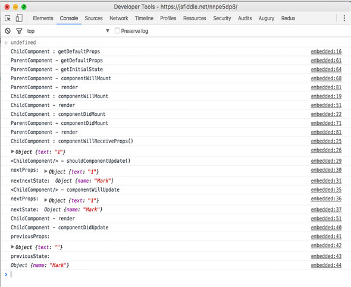
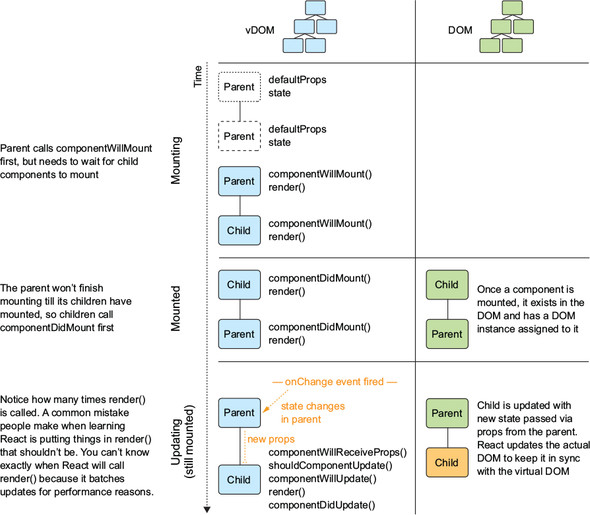
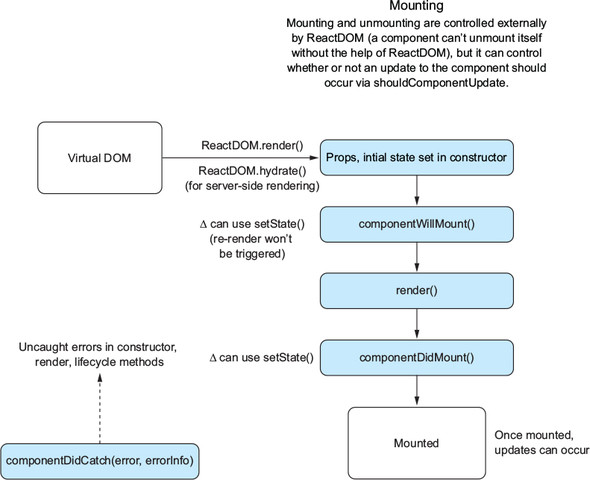
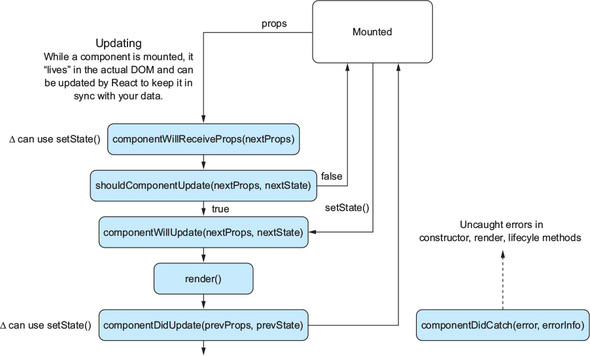
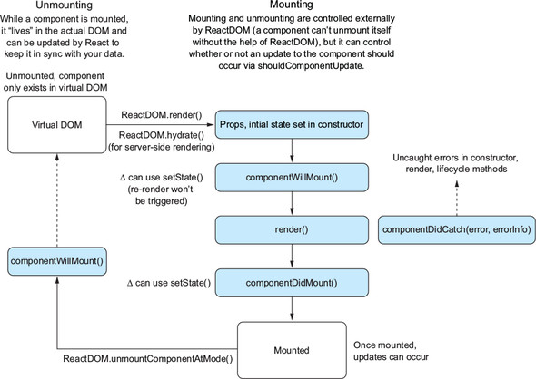

**Chapter 4. Rendering and lifecycle methods in React**

> jefqecar【】sharklasers.com

This chapter covers
- Getting set up with the application repository
- The rendering process
- Lifecycle methods
- Updating React components
- Creating a newsfeed using React

We’ll take a look at **_rendering_**, the process that React uses to turn your data into a user interface, and some ways to interact with a component over its lifecycle, called **_lifecycle methods_**. You’ll combine this with some of what you already know about reading and modifying data in React (props and state), updating your component state, and passing data to different components.


<!-- vim-markdown-toc GFM -->

* [4.1. Getting set up with the Letters Social repo](#41-getting-set-up-with-the-letters-social-repo)
    * [4.1.1. Getting the source code](#411-getting-the-source-code)
    * [4.1.2. Which version of node should I use?](#412-which-version-of-node-should-i-use)
    * [4.1.3. Note on tooling and CSS](#413-note-on-tooling-and-css)
    * [4.1.4. Deploying](#414-deploying)
    * [4.1.5. The API server and database](#415-the-api-server-and-database)
    * [4.1.6. Running the app](#416-running-the-app)
* [4.2. The render process and lifecycle methods](#42-the-render-process-and-lifecycle-methods)
    * [4.2.1. Introducing lifecycle methods](#421-introducing-lifecycle-methods)
    * [4.2.2. Types of lifecycle methods](#422-types-of-lifecycle-methods)
    * [4.2.3. Initial and “will” methods](#423-initial-and-will-methods)
    * [4.2.4. Mounting components](#424-mounting-components)
    * [4.2.5. Updating methods](#425-updating-methods)
    * [4.2.6. Unmounting methods](#426-unmounting-methods)
    * [4.2.7. Catching errors](#427-catching-errors)
* [4.3. Starting to create Letters Social](#43-starting-to-create-letters-social)

<!-- vim-markdown-toc -->

# 4.1. Getting set up with the Letters Social repo
In this chapter, you’re going to start building the application Letters Social. By the end of the book, Letters Social will be using server-side rendering, Redux, and React. You know what you’ll be building over the course of the book:
- Creating posts that have text
- Adding locations to posts with Mapbox
- Liking and commenting on posts
- Providing OAuth authentication via GitHub and Firebase
- Displaying posts in a newsfeed
- Using basic pagination

Letters Social, the React app that you’ll be building in this book. You can check out its source code at https://github.com/react-in-action/letters-social and the app at https://social.react.sh.

<div align="center">
    
</div>

You can also read some basic documentation about the files in the source code at https://docs.react.sh. It’s not comprehensive, but if you’d like to get a sense of the code and you like JSDoc-style documentation, the docs will be a good place to go. The README for the repo also lists a number of helpful resources. As always, feel free to reach out to me if you have questions (or if you just like the book!). You can do that through the README.

## 4.1.1. Getting the source code

> https://github.com/react-in-action/letters-social/tree/chapter-4

Head there and either download the source or use the following command to clone the repository:
```
git clone git@github.com:react-in-action/letters-social.git

git checkout chapter-4
```

Or, you can create the react app of yourself:
- https://github.com/keer2345/letters-social/tree/step-0

## 4.1.2. Which version of node should I use?

## 4.1.3. Note on tooling and CSS

## 4.1.4. Deploying

The app running at https://social.react.sh is deployed to https://zeit.co.

## 4.1.5. The API server and database
To prevent you from having to run a database like MongoDB or PostgreSQL, we’ll use a simulated REST API via the JSON-server library (https://github.com/typicode/json-server).


To create sample data or reset your application data, you can run this command:
```
npm run db:seed
```

I’ve included a number of helpers to make it easier to make requests to the API. You can see these functions in *src/shared/http.js*. I’m making use of the `isomorphic-fetch` library (https://github.com/matthew-andrews/isomorphic-fetch) because it mirrors the standard Fetch API available in browsers, but also runs on the server. 

## 4.1.6. Running the app
The easiest way to get started running the app in development mode will be to run the following:
```
yarn dev
```
or:
```
npm run dev
```

There are other commands you can use, too, but the main one you’ll want is `dev`. To see the other available commands, you can run this:
```
npm run
```

That should list every available command for the repository. Feel free to try each of them to see how they fit in. The main two you’ll be concerned with, though, are:
- `npm run dev`
- `npm run db:seed`

# 4.2. The render process and lifecycle methods

## 4.2.1. Introducing lifecycle methods
Overview of React. React will render (create, manage) components and create user interfaces from them.

<div align="center">
    
</div>

## 4.2.2. Types of lifecycle methods
This section looks at the different lifecycle methods provided by React in different groups and discusses what each one does. Lifecycle methods can be broken into two main groups:
- **_Will methods_** — Called right before something happens
- **_Did methods_** — Called right after something happens


Components have four main parts of their lifecycle and corresponding lifecycle methods for each:
- **_Initialization_** — When a component class is being instantiated.
- **_Mounting_** — A component is being inserted into the DOM.
- **_Updating_** — A component is being updated with new data via state or props.
- **_Unmounting_** — A component is being removed from the DOM.

Overview of the rendering process and a component’s lifecycle. This is the process that React uses as it manages your components for you. The three main parts of a component’s life are when it’s mounting, mounted, and unmounting. A component is mounting when it’s being inserted into the DOM, mounted once it is, and unmounting when it’s being removed.

<div align="center">
    
</div>


Overview of a component lifecycle in React. **`ReactDOM`** renders a component and certain lifecycle methods are called as React manages your component.

<div align="center">
    
</div>

To explore these methods, you’ll create two simple components—a parent and child—that will implement all the lifecycle methods we’ll look at. Head to https://codesandbox.io/s/2vxn9251xy to see how to add these components.

## 4.2.3. Initial and “will” methods
The first group of lifecycle-related properties to explore are the initial properties of a component.

- `defaultProps` — A static property that provides the default props for a component. Sets on `this.props` if that prop is not set by the parent component, is accessed before any components are mounted, and can’t rely on `this.props`. or `this.state`. Because `defaultProps` is a static property, it’s accessed from the class, not instances.
- `state` **_(initial)_** — The value of this property in the constructor will be the initial value set for the state of your component. That’s especially helpful when you need to provide placeholder content, set default values, or the like. It’s similar to default props with the exception that the data is expected to be mutated and only available on components that inherit from `React.Component`.

Output from the sample components once they’ve been fleshed out. A lifecycle method will trigger a message being logged to the console at each step, along with any arguments available to those methods. You can see the lifecycle methods in action at https://codesandbox.io/s/2vxn9251xy.

```js
import React from "react";
import { render } from "react-dom";
import PropTypes from "prop-types";

class ChildComponent extends React.Component {
  static propTypes = {
    name: PropTypes.string
  };
  static defaultProps = (function() {
    console.log("ChildComponent : defaultProps");
    return {};
  })();
  constructor(props) {
    super(props);
    console.log("ChildComponent: state");
    this.state = {
      name: "Mark"
    };
    this.oops = this.oops.bind(this);
  }
  componentWillMount() {
    console.log("ChildComponent : componentWillMount");
  }
  componentDidMount() {
    console.log("ChildComponent : componentDidMount");
  }
  componentWillReceiveProps(nextProps) {
    console.log("ChildComponent : componentWillReceiveProps()");
    console.log("nextProps: ", nextProps);
  }
  shouldComponentUpdate(nextProps, nextState) {
    console.log("<ChildComponent/> - shouldComponentUpdate()");
    console.log("nextProps: ", nextProps);
    console.log("nextState: ", nextState);
    return true;
  }
  componentWillUpdate(nextProps, nextState) {
    console.log("<ChildComponent/> - componentWillUpdate");
    console.log("nextProps: ", nextProps);
    console.log("nextState: ", nextState);
  }
  componentDidUpdate(previousProps, previousState) {
    console.log("ChildComponent: componentDidUpdate");
    console.log("previousProps:", previousProps);
    console.log("previousState:", previousState);
  }
  componentWillUnmount() {
    console.log("ChildComponent: componentWillUnmount");
  }
  oops() {
    this.setState(() => ({ oops: true }));
  }
  render() {
    if (this.state.oops) {
      throw new Error("Something went wrong");
    }
    console.log("ChildComponent: render");
    return [
      <div key="name">Name: {this.props.name}</div>,
      <button key="error" onClick={this.oops}>
        Create error
      </button>
    ];
  }
}

class ParentComponent extends React.Component {
  static defaultProps = (function() {
    console.log("ParentComponent: defaultProps");
    return {
      true: false
    };
  })();
  constructor(props) {
    super(props);
    console.log("ParentComponent: state");
    this.state = { text: "" };
    this.onInputChange = this.onInputChange.bind(this);
  }
  componentWillMount() {
    console.log("ParentComponent: componentWillMount");
  }
  componentDidMount() {
    console.log("ParentComponent: componentDidMount");
  }
  componentWillUnmount() {
    console.log("ParentComponent: componentWillUnmount");
  }
  onInputChange(e) {
    const text = e.target.value;
    this.setState(() => ({ text: text }));
  }
  componentDidCatch(err, errorInfo) {
    console.log("componentDidCatch");
    console.error(err);
    console.error(errorInfo);
    this.setState(() => ({ err, errorInfo }));
  }
  render() {
    console.log("ParentComponent: render");
    if (this.state.err) {
      return (
        <details style={{ whiteSpace: "pre-wrap" }}>
          {this.state.error && this.state.error.toString()}
          <br />
          {this.state.errorInfo.componentStack}
        </details>
      );
    }
    return [
      <h2 key="h2">Learn about rendering and lifecycle methods!</h2>,
      <input
        key="input"
        value={this.state.text}
        onChange={this.onInputChange}
      />,
      <ChildComponent key="ChildComponent" name={this.state.text} />
    ];
  }
}

render(<ParentComponent />, document.getElementById("root"));
```

<div align="center">
    
</div>

## 4.2.4. Mounting components
**_Mounting_** is the process of React inserting a component into the DOM.  The rendering process as it applies to the sample parent and child components.

<div align="center">
    
</div>

Mounting methods in the context of the larger lifecycle process. Components are added to the DOM, and as they are, several specific methods are fired along the way.

<div align="center">
    
</div>

## 4.2.5. Updating methods
Updating lifecycle methods. When a component is being updated, several hooks fire that let you determine whether the component should be updated at all, how to update, and when the update is done.

<div align="center">
    
</div>

## 4.2.6. Unmounting methods
**`React DOM`** is responsible for mounting and unmounting components. Mounting is the process of inserting your components into the DOM and unmounting is the opposite: the process of removing your components from the DOM. Once components are unmounted, they no longer exist in the DOM.

<div align="center">
    
</div>

## 4.2.7. Catching errors
Error handling is a first-class part of writing clean programs. So far, we haven’t seen any special methods in React for dealing with errors. If you’ve worked with React for a long time, you may remember that previous versions of React would lock up the entire app if an error occurred in a React component’s `render` or lifecycle methods. This was often a source of frustration, as it meant that an uncaught error could lock up the entire application.


# 4.3. Starting to create Letters Social
**_Webpack_** is an incredibly powerful tool used by many teams and companies.

The following listing shows the entrypoint file `src/index.js`:
```js
import React from "react"
import { render } from "react-dom"
import App from "./app"

render(<App />, document.getElementById("app"))
```


```
yarn add cofnig lodash parse-link-header js-cookie humanize-duration
yarn add cross-env @babel/plugin-proposal-class-properties --dev

yarn add font-awesome file-loader loaders.css css-loader style-loader node-sass sass-loader --dev
```


<div align="center">
    
</div>

The source code:
- https://github.com/react-in-action/letters-social/tree/chapter-4
- https://github.com/keer2345/letters-social/tree/chapter-4
