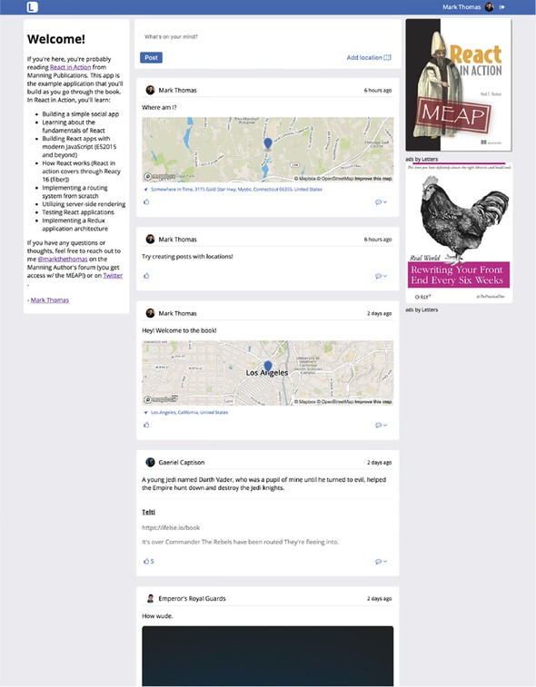

**Chapter 4. Rendering and lifecycle methods in React**

> jefqecar【】sharklasers.com

This chapter covers
- Getting set up with the application repository
- The rendering process
- Lifecycle methods
- Updating React components
- Creating a newsfeed using React

We’ll take a look at **_rendering_**, the process that React uses to turn your data into a user interface, and some ways to interact with a component over its lifecycle, called **_lifecycle methods_**. You’ll combine this with some of what you already know about reading and modifying data in React (props and state), updating your component state, and passing data to different components.

# 4.1. Getting set up with the Letters Social repo
In this chapter, you’re going to start building the application Letters Social. By the end of the book, Letters Social will be using server-side rendering, Redux, and React. You know what you’ll be building over the course of the book:
- Creating posts that have text
- Adding locations to posts with Mapbox
- Liking and commenting on posts
- Providing OAuth authentication via GitHub and Firebase
- Displaying posts in a newsfeed
- Using basic pagination

Letters Social, the React app that you’ll be building in this book. You can check out its source code at https://github.com/react-in-action/letters-social and the app at https://social.react.sh.

<div align="center">
    
</div>

You can also read some basic documentation about the files in the source code at https://docs.react.sh. It’s not comprehensive, but if you’d like to get a sense of the code and you like JSDoc-style documentation, the docs will be a good place to go. The README for the repo also lists a number of helpful resources. As always, feel free to reach out to me if you have questions (or if you just like the book!). You can do that through the README.

## 4.1.1. Getting the source code

> https://github.com/react-in-action/letters-social/tree/chapter-4

```
yarn init
yarn add react
```
