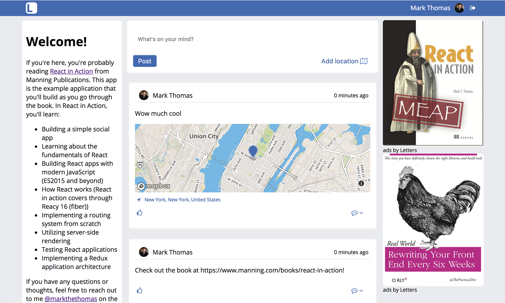

**Chapter 5. Working with forms in React**

> hqahmhgi【】sharklasers.com

This chapter covers
- Using forms in React
- Controlled and uncontrolled form components in React
- Validating and sanitizing data in React


<!-- vim-markdown-toc GFM -->

* [5.1. Creating posts in Letters Social](#51-creating-posts-in-letters-social)
    * [5.1.1. Data requirements](#511-data-requirements)
    * [5.1.2. Component overview and hierarchy](#512-component-overview-and-hierarchy)
* [5.2. Forms in React](#52-forms-in-react)
    * [5.2.1. Getting started with forms](#521-getting-started-with-forms)
    * [5.2.2. Form elements and events](#522-form-elements-and-events)
    * [5.2.3. Updating state in forms](#523-updating-state-in-forms)
    * [5.2.4. Controlled and uncontrolled components](#524-controlled-and-uncontrolled-components)
    * [5.2.5. Form validation and sanitization](#525-form-validation-and-sanitization)
* [5.3. Creating new posts](#53-creating-new-posts)
* [5.4. Summary](#54-summary)

<!-- vim-markdown-toc -->

# 5.1. Creating posts in Letters Social

Checkout the source code:
```
git clone git@github.com:react-in-action/letters-social.git
git checkout chapter-5-6
```

```
yarn add uuid bad-words
```

## 5.1.1. Data requirements
This code shows the basic schema for posts in Letters Social. We’re using a simple JavaScript class here because that’s what the server will actually use. When creating a post, the payload you send to the server needs to have most of the things defined in the schema.

The server will assign some smart defaults for properties you don’t specify but will ignore other properties that aren’t defined. One thing you won’t need to do in the browser is create a unique ID—the server can do that on its own.

Post schema (db/models.js):
```js
export class Post {
    constructor(config) {
        this.id = config.id || uuid();
        this.comments = config.comments || [];
        this.content = config.content || null;
        this.date = config.date || new Date().getTime();
        this.image = config.image || null;
        this.likes = config.likes || [];
        this.link = config.link || null;
        this.location = config.location || null;
        this.userId = config.userId;
    }
}
```

## 5.1.2. Component overview and hierarchy
The final Letters Social app you’ll be building. Can you see any ways you can break things out into components?

<div align="center">
    
</div>

Here’s what you have so far in your Letters app:
- Post data available to use from the API; some posts have images, others have links
- User data for each post, with some avatar info
- An App component that serves as the catch-all component for the entire application
- A Post component that you use as you iterate over the data from the API

Existing and future components. You’ve created Post and App components that fetch and iterate over data. The Create Post component will exist outside components used to display posts.


<div align="center">
    
</div>

Let’s see how to create the skeleton for your component. You’ll put in just the basics of a component that will render a basic element out, import the right tools, export the `Component` class, and set up PropTypes to be defined later. The following listing shows how to create this basic skeleton.

Creating a component skeleton (src/components/post/Create.js):
```js
import React, { Component } from 'react';
import PropTypes from 'prop-types';

class CreatePost extends Component {
  static propTypes = {
  }
  constructor(props) {
    super(props);
  }
  render () {
    return (
      <div className="create-post">
        Create a post — coming (very) soon
      </div>
    );
  }
}

export default CreatePost;
```

# 5.2. Forms in React

## 5.2.1. Getting started with forms
There’s no standard way to do forms across front-end frameworks.

You use components, state, and props to create forms. Let’s review some parts of React’s mental model before moving on:
- Components have two main ways of working with data: state and props.
- Because they’re JavaScript classes, components can have custom class methods in addition to lifecycle hooks that can be used to respond to events and for just about anything else.
- As you might for regular DOM elements, you can listen for events like clicks, input changes, and other events in React components.
- Parent components (such as form elements) can provide callback methods as props to child components, making it possible for components to communicate with each other.


## 5.2.2. Form elements and events
Adding to your CreatePost component (src/components/post/Create.js):
```js
//...
class CreatePost extends Component {
  render() {
    return (
      <div className="create-post">
                <textarea
                    placeholder="What's on your mind?"
                />
                </div>
                <button>Post</button>
            </div>
    );
  }
}
//...
```

Many different events can occur in the browser as a result of user interaction—including mouse moves, keyboard typing, clicks, and more. We’re concerned with a few of these types of events in particular when it comes to your app. For our purposes, you want to listen with two main event handlers — `onChange` and `onClick`:
- **`onChange`** — This is fired when an input element changes. You can access the new value of the form element using `event.target.value`.
- **`onClick`** — This is fired when an element is clicked. You’ll listen for this so you can know when a user wants to send a post to the server.

Adding to your CreatePost component (src/components/post/Create.js):
```js
class CreatePost extends Component {
  constructor(props) {
    super(props);
    this.handleSubmit = this.handleSubmit.bind(this);
    this.handlePostChange = this.handlePostChange.bind(this);
  }

  handlePostChange(e) {
            console.log('Handling an update to the post body!');
  }

  handleSubmit() {
     console.log('Handling submission!');
  }

  render() {
    return (
       <div className="create-post">
                <button onClick={this.handleSubmit}>Post</button>
                <textarea
                    value={this.state.content}
                    onChange={this.handlePostChange}
                    placeholder="What's on your mind?"
                />
          </div>
    );
  }
}
```

Event handlers receive a synthetic event as an argument, and we have access to a number of available properties on the synthetic event.


<div align="center">
    
</div>

Before we move on, try something: add `console.log(event)` to the post component’s change event handler. If you type something into the `textarea` element and open the developer console for your browser, you should see messages being logged out. If you inspect these objects or try accessing some of the properties in table 5.1, you should get back information about the event. For our purposes, we’ll be concerned with the `target` property that you get back. Remember, `event.target` is just a reference to the DOM element that dispatched the event, as it would be in normal JavaScript.

React passes a synthetic event to event handlers that you set up. It’s a normalized event, meaning you can access the same properties and data as you would for a regular browser event.

<div align="center">
    
</div>

## 5.2.3. Updating state in forms
You can listen for events now and watch as your component listens to updates and submission events, but you’re not doing anything with the data yet. You need to do something with the events to update your application state. This is the key way you work with forms in React: by receiving events from event handlers and then using data from those events to update state or props.

Updating component state using inputs (src/components/post/Create.js):
```js
class CreatePost extends Component {
  constructor(props) {
    super(props);

    // Set up state
    this.state = {
      content: '',
    };

    // Set up event handlers
    this.handleSubmit = this.handleSubmit.bind(this);
    this.handlePostChange = this.handlePostChange.bind(this);
  }

  handlePostChange(event) {
    const content = event.target.value;
        this.setState(() => {
            return {
                content,
            };
        });
  }

  handleSubmit() {
      console.log(this.state);
  }

  render() {
    return (
       <div className="create-post">
                <button onClick={this.handleSubmit}>Post</button>
                <textarea
                    value={this.state.content}
                    onChange={this.handlePostChange}
                    placeholder="What's on your mind?"
                />
       </div>

    );
  }
}
```

## 5.2.4. Controlled and uncontrolled components
Controlled components listen for events emitted by a DOM element, operate on the emitted data, and then update the component state and set the value of the element. This keeps everything in the domain of the component and creates a unified state universe. Uncontrolled components maintain their own internal state and create a situation where a microcosm exists within the component, cutting off access to and control of that state.

<div align="center">
    
</div>

In an uncontrolled component, rather than use a value property to set data, the component maintains its own internal state. You can still listen for updates to the input using an event handler, but you’ll no longer manage the state of the input. We’ll stick to using controlled components in this book, but it’s important to at least know what this pattern looks like in practice.

```js
class CreatePost extends Component {
  constructor(props) {
    super(props);

    this.state = {
      content: '',
    };

    this.handleSubmit = this.handleSubmit.bind(this);
    this.handlePostChange = this.handlePostChange.bind(this);
  }

  handlePostChange(event) {
    const content = event.target.value;
    this.setState(() => {
        return {
            content,
        };
   });
  }

  handleSubmit() {
     console.log(this.state);
  }

  render() {
    return (
<div className="create-post">
                <button onClick={this.handleSubmit}>Post</button>
                <textarea
                    onChange={this.handlePostChange}
                    placeholder="What's on your mind?"
                />
       </div>
     );
  }
}
```

## 5.2.5. Form validation and sanitization
You need to ask yourself a few questions when setting up validation for forms and inputs in your applications:
- What are the data requirements for the application?
- Based on these constraints, how can you help your users provide meaningful data?
- Are there ways you can eliminate inconsistencies in data that users provide?

Adding basic validation (src/components/post/Create.js):
```js
//...
class CreatePost extends Component {
  constructor(props) {
    super(props);

    this.state = {
      content: '',
      valid: false,
    };

    this.handleSubmit = this.handleSubmit.bind(this);
    this.handlePostChange = this.handlePostChange.bind(this);
  }

  handlePostChange(event) {
    const content = event.target.value;
    this.setState(() => {
            return {
                content,
                valid: content.length <= 280
            };
    });
  }

  handleSubmit() {
    if (!this.state.valid) {
       return;
    }
    const newPost = {
        content: this.state.content,
    };

    console.log(this.state);
  }

  render() {
    return (
      <div className="create-post">
                <button onClick={this.handleSubmit}>Post</button>
                <textarea
                    value={this.state.content}
                    onChange={this.handlePostChange}
                    placeholder="What's on your mind?"
                />
       </div>
     );
  }
}
```

You’ll use a JavaScript module called bad-words, available from npm to help us out. `bad-words` takes in a string and replaces any words found on a blacklist (you can create your own and substitute it for the default if you prefer) with asterisks.

# 5.3. Creating new posts
To send your post up to the API, you’ll need to do the following things, in addition to what the CreatePost component is already doing, which includes keeping track of state, doing some basic validation, and performing some basic content sanitization.

Next, you’ll need to do the following to send the data up to your API:
1. Capture the user input to be used as the post, updating state and performing the data-checking logic you’ve implemented so far.
1. Call an event handler function passed from the parent component (the main App component in this case) as a prop and give the post data to it.
1. Reset the CreatePost component’s state.
1. In the parent component, use the data passed from the CreatePost child component to perform an HTTP POST to the server.
1. Update the local component state with the new post you receive from the server.
1. To get a better grasp on what you’ll be doing, see the illustration in follow figure.

The CreatePost component overview. The CreatePost component receives a function as a prop, uses its internal state as an input for that function, and calls it when the user clicks Submit. That function, passed from the parent App component, sends the data to the API, updates the local posts, and initiates a refresh of posts from the API.

<div align="center">
    
</div>

Handling post submissions (src/app.js):
```js
import * as API from './shared/http';

//...

export default class App extends Component {
  //...
  createNewPost(post) {
     this.setState(prevState => {
                    return {
                        posts: orderBy(prevState.posts.concat(newPost),
     'date', 'desc')
                    };
                });

  }
  //...
}
```

Passing callbacks as props (src/app.js):
```js
import CreatePost from './post/Create';

export default class App extends Component {
  //...
  render() {
   return (
     //...
     <CreatePost onSubmit={this.createNewPost} />
     //...
      )
     }
  //...
}


```

# 5.4. Summary
Here are the main things you learned in this chapter:
- Forms are handled in React much like any other component: you can use events and event handlers to pass data around and submit data.
- React doesn’t provide any “magic” ways to work with forms. Forms are just components.
- Form validation and sanitization work within the same React mental model of events, component updates, rerendering, state and props, and so on.
- You can pass functions as props between components, which is a powerful and useful design pattern that prevents coupled components but promotes component communication.
- Data validation and sanitization aren’t “magic”—React lets you use regular JavaScript and libraries to work with your data.
